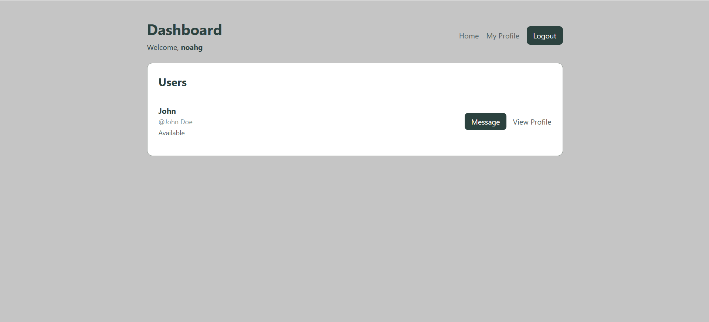
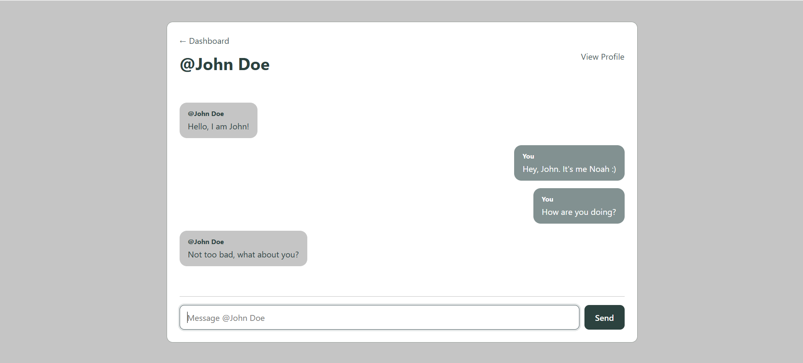
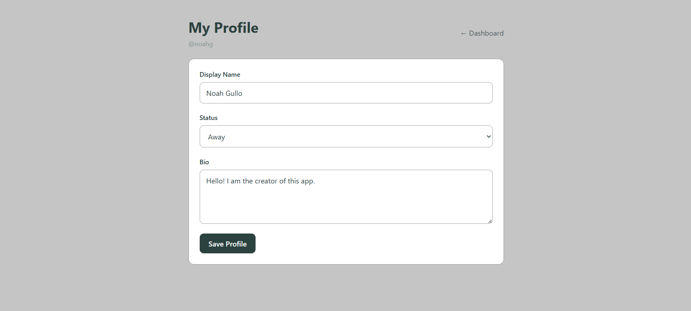

# Messaging App

## Live Demo

[Try the Live Demo](https://transmit-production-b0d1.up.railway.app/)

## Description

A full-stack messaging application that lets users connect and communicate with each other. Create an account, browse other users, customize your profile, and exchange direct messages through a clean and responsive interface.

## Screenshots

### User Directory

  

### Direct Messaging

  

### Edit Profile

  

## Core Features

* User authentication. Users can create an account, log in, and log out using Passport.js.
* Direct messaging. Users can send messages to other users and view their message history.
* User directory. Users can browse other accounts and choose to message them or view their profiles.
* Customizable profiles. Users can update their display name, status, and bio, as well as view other users' profiles.
* Persistent data. User accounts, profiles, and messages are stored in a PostgreSQL database and remain available across sessions.

## Tech Stack

| Area           | Technologies                   |
| -------------- | ------------------------------ |
| **Frontend**   | React, React Router, Vite, CSS |
| **Backend**    | Node.js, Express, Passport.js  |
| **Database**   | PostgreSQL, Prisma ORM         |
| **Deployment** | Railway                        |

## API

| Method | Endpoint                 | Description                                           |
| ------ | ------------------------ | ----------------------------------------------------- |
| `POST` | `/signup`                | Creates a new user account                            |
| `POST` | `/login`                 | Authenticates a user                                  |
| `POST` | `/logout`                | Logs out the authenticated user                       |
| `GET`  | `/users`                 | Retrieves users available for messaging               |
| `GET`  | `/profile`               | Retrieves the authenticated user's profile            |
| `PUT`  | `/profile`               | Updates the authenticated user's profile              |
| `GET`  | `/users/:userId/profile` | Retrieves the profile of a specific user              |
| `GET`  | `/messages/:userId`      | Retrieves messages between the current and given user |
| `POST` | `/messages/:userId`      | Sends a message to a specific user                    |

## Reflection

This project was a great opportunity to build a full-stack application centered around communication between users. I got the chance to work with authentication, relational data, user profiles, and direct messaging while figuring out how the frontend and backend should work together to manage user-specific data. Implementing messaging was especially useful for learning how to structure relationships between users and messages in the database. I also gained more experience using Passport.js to manage authentication and sessions across the frontend and backend. On the backend, I continued practicing separation of concerns by keeping routing, controller logic, authentication, and database access organized while building an API that supports the different parts of the messaging experience.
